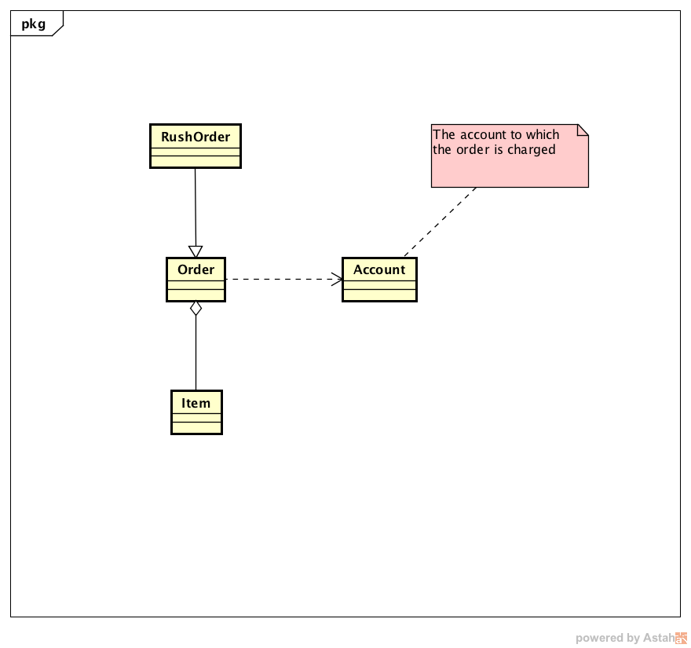
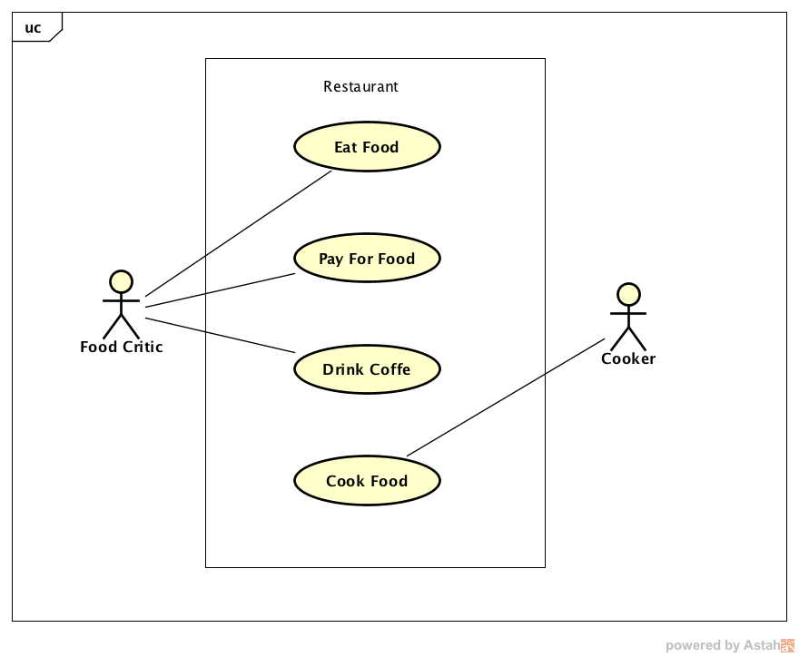
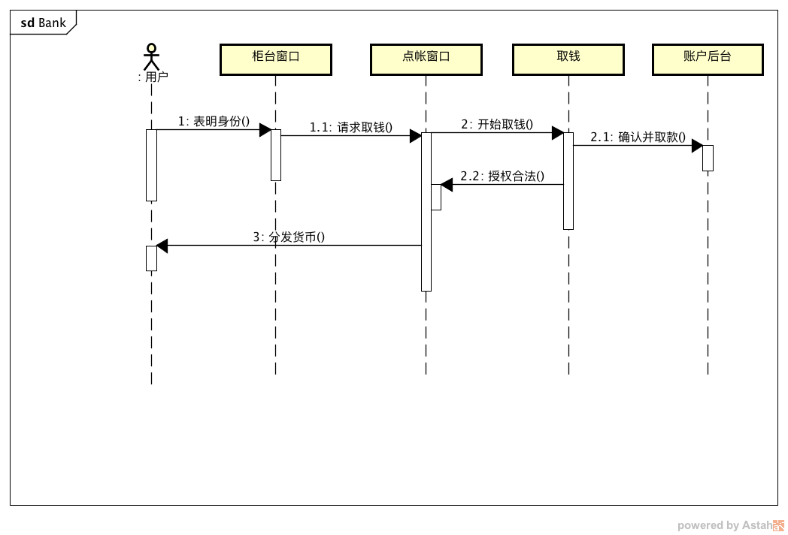

# Oriented-Object

<!-- MarkdownTOC -->

- [1. 分析 Oriented-Object 和 Process-Oriented](#1-%E5%88%86%E6%9E%90-oriented-object-%E5%92%8C-process-oriented)
    - [1.1 History](#11-history)
    - [1.2 OO 总结](#12-oo-%E6%80%BB%E7%BB%93)
- [2. OOD by UML](#2-ood-by-uml)
    - [2.1 Class Diagram \(不完整\)](#21-class-diagram-%E4%B8%8D%E5%AE%8C%E6%95%B4)
    - [2.2 UseCase Diagram](#22-usecase-diagram)
    - [2.3 Sequence Diagram](#23-sequence-diagram)
- [3. 分析 Overload 和 Override](#3-%E5%88%86%E6%9E%90-overload-%E5%92%8C-override)
    - [3.1 Method Signature](#31-method-signature)
    - [3.2 Override](#32-override)
    - [3.3 Overload](#33-overload)
- [4. 分析 Access Visibility](#4-%E5%88%86%E6%9E%90-access-visibility)
    - [4.1 类](#41-%E7%B1%BB)
    - [4.2 类中 field 和 method](#42-%E7%B1%BB%E4%B8%AD-field-%E5%92%8C-method)
- [5. 封装与继承的设计原则](#5-%E5%B0%81%E8%A3%85%E4%B8%8E%E7%BB%A7%E6%89%BF%E7%9A%84%E8%AE%BE%E8%AE%A1%E5%8E%9F%E5%88%99)
- [6. Inheritance hierarchy](#6-inheritance-hierarchy)
    - [6.1 `java.lang`](#61-javalang)
    - [6.2 `java.util`](#62-javautil)
    - [6.3 `java.time`](#63-javatime)
- [7. 分析 Object methods](#7-%E5%88%86%E6%9E%90-object-methods)
    - [7.1 equals\(\)](#71-equals)
    - [7.2 hash value, hash table 和 hashCode\(\)](#72-hash-value-hash-table-%E5%92%8C-hashcode)
    - [7.3 toString\(\)](#73-tostring)
- [8. Reflection](#8-reflection)
- [9. Proxy](#9-proxy)
- [10. Interface](#10-interface)
    - [10.1 使用 Lambda 表达式简化 funcitonal interface 实现](#101-%E4%BD%BF%E7%94%A8-lambda-%E8%A1%A8%E8%BE%BE%E5%BC%8F%E7%AE%80%E5%8C%96-funcitonal-interface-%E5%AE%9E%E7%8E%B0)
- [11. 系统总结 inner class \(暂时不做高要求\)](#11-%E7%B3%BB%E7%BB%9F%E6%80%BB%E7%BB%93-inner-class-%E6%9A%82%E6%97%B6%E4%B8%8D%E5%81%9A%E9%AB%98%E8%A6%81%E6%B1%82)
    - [11.1 为甚要使用 inner class](#111-%E4%B8%BA%E7%94%9A%E8%A6%81%E4%BD%BF%E7%94%A8-inner-class)
    - [11.2 语法规则](#112-%E8%AF%AD%E6%B3%95%E8%A7%84%E5%88%99)
- [12. 分析 Java 中的缓存机制](#12-%E5%88%86%E6%9E%90-java-%E4%B8%AD%E7%9A%84%E7%BC%93%E5%AD%98%E6%9C%BA%E5%88%B6)
    - [12.1 整型和浮点型](#121-%E6%95%B4%E5%9E%8B%E5%92%8C%E6%B5%AE%E7%82%B9%E5%9E%8B)
    - [12.2 String 类型](#122-string-%E7%B1%BB%E5%9E%8B)
- [13. 总结 Enum](#13-%E6%80%BB%E7%BB%93-enum)

<!-- /MarkdownTOC -->

<a name="1-%E5%88%86%E6%9E%90-oriented-object-%E5%92%8C-process-oriented"></a>
## 1. 分析 Oriented-Object 和 Process-Oriented

<a name="11-history"></a>
### 1.1 History

20 世纪 70 年代中期, 以 C 语言为代表的面向过程的程序语言已经大面积应用, 此时软件开发以 **算法+数据结构=程序** 的思想进行设计, 与此同时, 操作系统, 编译器, 数据库软件开始发展.

20 世纪 90 年代, Java 的出现降低了 C++ 的复杂度, 面向对象编程开始大面积应用, 此时软件开发以 **对象+通讯=应用** 的思想进行设计与开发, 尤其是在企业级开发中.

更多: 
面向 ** 语言：面向 WEB、面向高并发、面向切面、函数式语言、面向终端开发等编程思想和语言, 只是对现有程序设计语言的改进，并为解决特定领域, 特定问题而有的.


<a name="12-oo-%E6%80%BB%E7%BB%93"></a>
### 1.2 OO 总结

OO 核心思想 ：封装，继承，多态。

相较于 PO:  
- 封装: 去掉全局变量
- 继承: 去掉代码冗余
- 多态: 为了让继承得以实现

综上 OO: 1. 去全局变量; 2. 去代码冗余;

<a name="2-ood-by-uml"></a>
## 2. OOD by UML
UML (Unified Modeling Language), 是一个支持模型化和软件系统开发的图形化语言; 为软件开发的所有阶段提供模型化和可视化的支持.

<a name="21-class-diagram-%E4%B8%8D%E5%AE%8C%E6%95%B4"></a>
### 2.1 Class Diagram (不完整)
定义系统中的类结构，以及类之间的关系。

- Denpendency (uses-a), 一个类的方法操纵另一个类的对象, 则这个类依赖另一个类;
- Aggregation (has-a), 类 A 的 instance field 中, 包含类 B;
- Inheritance (is-a), 


<a name="22-usecase-diagram"></a>
### 2.2 UseCase Diagram
用例图能够以可视化的方式, 表达系统如何满足所收集的业务规则, 以及特定用户需求信息.



<a name="23-sequence-diagram"></a>
### 2.3 Sequence Diagram
顺序图用于按照交互发生的一系列顺序, 显示对象之间的交互




<a name="3-%E5%88%86%E6%9E%90-overload-%E5%92%8C-override"></a>
## 3. 分析 Overload 和 Override

<a name="31-method-signature"></a>
### 3.1 Method Signature
`method_name(param1, param2, ...)` 就是 method signature.

<a name="32-override"></a>
### 3.2 Override

当子类继承父类, 父类的方法不满足子类行为要求的时候, 子类就需要 Override 父类方法. 要求: 

- signature 不变;
- 返回值:
    + 若为 primitive type, 则必须相同;
    + 若为 reference type, 则必须相同或子类;
-  Access Modifier 不小于父类被覆盖方法;
-  抛出的异常范围不大于父类被覆盖的方法;


<a name="33-overload"></a>
### 3.3 Overload

当类中某个行为需要多种表现形式, 如乘法中, 需要有整数乘法和浮点数乘法, 此时就需要 Overload 方法, 要求: 

- signature 中, 形参列表必须不同
- 返回值类型, Access Modifier, 抛出异常范围没有要求;

<a name="4-%E5%88%86%E6%9E%90-access-visibility"></a>
## 4. 分析 Access Visibility

<a name="41-%E7%B1%BB"></a>
### 4.1 类

没有 public 修饰的类, 在不同的包中, 无法访问.

<a name="42-%E7%B1%BB%E4%B8%AD-field-%E5%92%8C-method"></a>
### 4.2 类中 field 和 method

(当然这里指的是 public class)
- public > protected > (默认不写) > private
- Instance Inner Class 具有类中成员相同的访问控制修饰符

<a name="5-%E5%B0%81%E8%A3%85%E4%B8%8E%E7%BB%A7%E6%89%BF%E7%9A%84%E8%AE%BE%E8%AE%A1%E5%8E%9F%E5%88%99"></a>
## 5. 封装与继承的设计原则

Encapsulation:  
- 保证数据私有;
- 保证数据初始化;
- field 不要使用过多的 primitive type;
- 只提供需要的 accessor and mutator method;
- 分解职责过多的类;
- 见名知意;
- 优先使用 immutable class (确保线程安全);
from *Java 核心技术卷 1, 4.10*

Inheritance and Polymorphism:
- 将公共的操作和域放在父类;
- 不要使用 protected 修饰域; 应该使用 protected 修饰希望被子类重写的 method;
- 除非继承符合 'is-a', 并有意义, 才用继承; (如: Employee - Contractor, Calendar - Hoilday)
- 在覆盖方法时, 不要改变预期的行为;
- 使用多态代替类型信息;
- 不要过多的使用反射;

<a name="6-inheritance-hierarchy"></a>
## 6. Inheritance hierarchy

<a name="61-javalang"></a>
### 6.1 `java.lang`
Provides classes that are fundamental to the design of the Java programming language.

1. String, StringBuffer, StringBuilder

2. The Hierarchy of Exception
- Unchecked excepiton:
    + Error
    + RuntimeException
        * `ClassCastException`
        * `IllegalArgumentException`
        * `IndexOutOfBoundsException`
        * `NullPointerException`
剩下的都是 Checked Exception。

Checked Exception 捕捉的次序总结：

todo...


<a name="62-javautil"></a>
### 6.2 `java.util`
Contains the collections framework, legacy collection classes, event model, date and time facilities, internationalization, and miscellaneous(混杂的) utility classes (a string tokenizer, a random-number generator, and a bit array).


<a name="63-javatime"></a>
### 6.3 `java.time`
The main API for dates, times, instants, and durations. JDK 1.8


<a name="7-%E5%88%86%E6%9E%90-object-methods"></a>
## 7. 分析 Object methods

<a name="71-equals"></a>
### 7.1 equals()
[The Java Language Specification](http://docs.oracle.com/javase/specs/) 要求: 
- 自反性, 对于任意非空引用 x, x.equals(x) 返回 true; 
- 对称性, 对于任意非空引用 x, y, x.equals(y) 与 y.equals(x) 应该相等;
- 传递性, 对于任意非空引用 x, y, z, x.equals(y) 为 true, y.equals(z) 为 true, 则 x.equals(z) 也为 true;
- 一致性, 对于任意非空引用 x, y, 如果 x, y 没有改变, 则 x.equals(y) 也不会变;
- 对于任意非空引用 x, x.equals(null) 返回 false;

采用 getClass(), instanceof 的标准:  
1. 如果子类拥有自己相等的概念, 则根据对称性要求, 应该强制使用 getClass();
2. 如果由父类决定相等的概念, 那么应该使用 instanceof, 这样不同的子类对象就可以进行比较;

<a name="72-hash-value-hash-table-%E5%92%8C-hashcode"></a>
### 7.2 hash value, hash table 和 hashCode()

如果 Employee.equals() 比较的是 emp 的 ID, 则 hashCode() 方法就需要散列 ID, 而不是 name, salary.

其中，Object 中计算 hashcode 的方法是：计算存储地址；而 String 是通过计算字符得到。


<a name="73-tostring"></a>
### 7.3 toString()

用于日志: 

```java
@Override 
public String toString() {
    return this.getClass().getName() + "[field1=" + this.field + "..." + "]";
}
```


<a name="8-reflection"></a>
## 8. Reflection

### 8.1 Reflection 基础

```java
// 3 种创建 Class 的对象的方法 
Test test = new Test();
Class c1 = Test.class;
Class c2 = test.getClass();
Class c3 = null;
try {
    c3 = Class.forName("com.immoc.reflect.Test");
} catch (ClassNotFoundException e) {
    e.printStackTrace();
}
```

### 8.2 动态加载类

动态加载类，可以实现 “系统功能模块升级，而不需要重新编译主程序”。

```java
/**
 * 主程序
 */
public class Main {
    public static void main(String[] args) {
        FooImpl fi = null;
        Class c1 = null;
        try {
            c1 = Class.forName(args[0]);    // 创建 Class 类的实例
            fi = (FooImpl)c1.newInstance(); // 创建 Class 类的实例 的实例 ！！！
            fi.start(); // 此处的 FooImpl 是定义方法的接口
        } catch(Exception e) {
            e.printStackTrace();
        }
    }
}
```

```java
/**
 * interface
 */
public interface FooImpl {
    void start();
}
```

```java
/**
 * 一个具体的功能类
 */
public class Excel implements FooImpl{
    public void start() {
        System.out.println("Excel... start!");
    }
}

```

### 8.3 通过类对象获取类的结构 (Constructor / Field / Method)

```java
public class ClassUtil {
    /*
     * 打印所有的 Field
     * getFields() 方法：(public)
     * Returns an array containing {@code Field} objects reflecting all
     * the accessible public fields of the class or interface represented by
     * this {@code Class} object.
     */
    public static void printClassFields(Object obj) {
        Class c = obj.getClass();
        Field[] fields = c.getFields();
        for(Field field : fields) {
            System.out.println(Modifier.toString(field.getModifiers()) + " " + field.getName());
        }
    }

    /*
     * 打印所有的 Methods
     * getMethods(): (public)
     * Returns an array containing {@code Method} objects reflecting all the
     * public methods of the class or interface represented by this {@code
     * Class} object, including those declared by the class or interface and
     * those inherited from superclasses and superinterfaces.
     */
    public static void printClassMethods(Object obj) {
        Class c = obj.getClass();
        Method[] methods = c.getMethods();
        for(Method method : methods) {
            Class<?>[] parameterTypes = method.getParameterTypes();
            Class<?> returnType = method.getReturnType();
            // print method
            System.out.print(returnType.getName() + " " + method.getName() 
                + "(");
            for(int i=0; i<parameterTypes.length; ++i) {
                System.out.print(parameterTypes[i].getName()); 
                if (i != parameterTypes.length-1) {
                    System.out.print(", ");
                }
            }
            System.out.println(")");
        }
    }

    public static void main(String[] args) {
        ClassUtil.printClassFields(new People());
        ClassUtil.printClassMethods(new People());
        
        ClassUtil.printClassFields(new Student());
        ClassUtil.printClassMethods(new Student());
    }
}

```

### 8.4 通过 Reflect 调用方法

```java
public class Demo2 {

    public static void main(String[] args) throws Throwable{
        A a = new A();
        Class c = a.getClass();
        Method m = c.getDeclaredMethod("say", String.class, String.class);
        String ret = (String) m.invoke(a, "Hello", "World");
        System.out.println(ret);
    }

}

class A {
    public String say(String a, String b) {
        return a.toUpperCase() + " " + b.toLowerCase();
    }
}
```


### 8.5 深入理解

* Java 编译后是去泛型化的，即泛型只在编译之前有效，防止错误输入；
* 可以通过反射调用方法，向集合中传入不规范的数据；
<a name="9-proxy"></a>
## 9. Proxy


<a name="10-interface"></a>
## 10. Interface

The component of interface: 
- `public abstract return_type method_name(formal params);` (抽象方法)
- `public static data_type FEILD_NAME = field_value;` (静态常量)
- `public static return_type method_name(formal params) {//...}` (静态方法, Java 8) 
- `default return_type method_name(formal params)` (默认方法, 但是子类都会重写此类方法的, Java 8)

<a name="101-%E4%BD%BF%E7%94%A8-lambda-%E8%A1%A8%E8%BE%BE%E5%BC%8F%E7%AE%80%E5%8C%96-funcitonal-interface-%E5%AE%9E%E7%8E%B0"></a>
### 10.1 使用 Lambda 表达式简化 funcitonal interface 实现

```java
// 1. 方法引用
Timer t = new Timer(1000, System.out:println);
Timer t = new Timer(1000, x-> System.out.println(x));

Arrays.sort(strs, String:compareTo);
Arrays.sort(strs, (str1, str2) -> str1.compareTo(str2));


// 2. 构造器引用

Stream<Person> stream = names.stream().map(Person::new);
Person[] people = stream.toArray(Person[]::new);
```


<a name="11-%E7%B3%BB%E7%BB%9F%E6%80%BB%E7%BB%93-inner-class-%E6%9A%82%E6%97%B6%E4%B8%8D%E5%81%9A%E9%AB%98%E8%A6%81%E6%B1%82"></a>
## 11. 系统总结 inner class (暂时不做高要求)

<a name="111-%E4%B8%BA%E7%94%9A%E8%A6%81%E4%BD%BF%E7%94%A8-inner-class"></a>
### 11.1 为甚要使用 inner class
- 内部类的方法可以直接访问外部类的所有数据，包括私有的数据;
- 内部类提供了更好的封装，可以把内部类隐藏在外部类之内，不允许同一个包中的其他类访问该类;
- 当定义一个回调函数而不愿意编写大量代码的时候,就可以使用 `anonymous inner class`;

<a name="112-%E8%AF%AD%E6%B3%95%E8%A7%84%E5%88%99"></a>
### 11.2 语法规则
1. 分类:
- **成员内部类**
- **静态内部类**
- 方法内部类
- **匿名内部类**

2. 静态内部类

静态内部类是 static 修饰的内部类，这种内部类的特点是：

1、 静态内部类不能直接访问外部类的非静态成员，但可以通过 new 外部类().成员 的方式访问 

2、 如果外部类的静态成员与内部类的成员名称相同，可通过“类名.静态成员”访问外部类的静态成员；如果外部类的静态成员与内部类的成员名称不相同，则可通过“成员名”直接调用外部类的静态成员

3、 创建静态内部类的对象时，不需要外部类的对象，可以直接创建 内部类 对象名= new 内部类();


<a name="12-%E5%88%86%E6%9E%90-java-%E4%B8%AD%E7%9A%84%E7%BC%93%E5%AD%98%E6%9C%BA%E5%88%B6"></a>
## 12. 分析 Java 中的缓存机制

<a name="121-%E6%95%B4%E5%9E%8B%E5%92%8C%E6%B5%AE%E7%82%B9%E5%9E%8B"></a>
### 12.1 整型和浮点型

1. 整型具有缓存机制：
- `Integer`:[-128, m], 其中 m>=127；在 Oracle JDK 中是 [-128, 127]
- `Short`: [-128, 127]
- `Byte`: [-128, 127]
- `Long`: [-128, 127]

2. 浮点型不具有缓存机制


3. 通过分析 `Integer` 源码解释特殊性


```java
/**
 * The value of the {@code Integer}.
 */
private final int value;

```

内部类 `Integer.IntegerCache` 分析：
```java
private static class IntegerCache {
    static final int low = -128;
    static final int high;
    static final Integer cache[];

    static {
        // 也就是 high 是根据不同的 JDK 确定的。
        // high value may be configured by property(属性)
        int h = 127;
        String integerCacheHighPropValue =
            sun.misc.VM.getSavedProperty("java.lang.Integer.IntegerCache.high");
        if (integerCacheHighPropValue != null) {
            try {
                int i = parseInt(integerCacheHighPropValue);
                i = Math.max(i, 127);
                // Maximum array size is Integer.MAX_VALUE
                h = Math.min(i, Integer.MAX_VALUE - (-low) -1);
            } catch( NumberFormatException nfe) {
                // If the property cannot be parsed into an int, ignore it.
            }
        }
        high = h;

        cache = new Integer[(high - low) + 1];
        int j = low;
        for(int k = 0; k < cache.length; k++)
            cache[k] = new Integer(j++);

        // range [-128, 127] must be interned (JLS7 5.1.7)
        assert IntegerCache.high >= 127;
    }
    private IntegerCache() {}
}
```

<a name="122-string-%E7%B1%BB%E5%9E%8B"></a>
### 12.2 String 类型


在 String 类型的缓存机制之外, 有 2 种情况会重新创建对象:
- 通过 `new String()` 构造方法;
- 通过 `s5 = s + s2;` 需要通过编译的情况;

```java
String s = "Hello";
String s2 = "World";
String s3 = "HelloWorld";
String s4 = "Hello" + "World";
String s5 = s + s2;
String s6 = new String("HelloWorld");

System.out.println(s3 == "HelloWorld"); // true
System.out.println(s4 == "HelloWorld"); // true
System.out.println(s5 == "HelloWorld"); // false
System.out.println(s6 == "HelloWorld"); // false
```

```java
/**
 * Initializes a newly created {@code String} object so that it represents
 * the same sequence of characters as the argument; in other words, the
 * newly created string is a copy of the argument string. Unless an
 * explicit copy of {@code original} is needed, use of this constructor is
 * unnecessary since Strings are immutable.
 * 该方法是返回一个 origin 副本,除非是明确需要制作新的副本,否则是不必要的,因为 String 不可变类.
 * 其实上面这句话,也就解释了通过  new String() 会创建一个新的对象.
 */
public String(String original) {
    this.value = original.value;
    this.hash = original.hash;
}

```


<a name=""></a>
<a name="13-%E6%80%BB%E7%BB%93-enum"></a>
## 13. 总结 Enum

```java
public class Demo1 {
    public static void main(String[] args) {
        Scanner sc = new Scanner(System.in);
        System.out.println("input a season:");
        String input = sc.nextLine().toUpperCase();
        Season season = Season.valueOf(Season.class, input);
        System.out.println(season.getAbbreviation());
    }
}

/**
 * 一般只会用到很简单的功能
 */
enum Season {
    SPRING("春天"), SUMMER("夏天"), FALL("秋天"), WINTER("冬天");
    
    private String abbreviation;
    
    // 请注意是 private 
    private Season(String abbreviation) {
        this.abbreviation = abbreviation;
    }
    
    public String getAbbreviation() {
        return this.abbreviation;
    }
}
```
