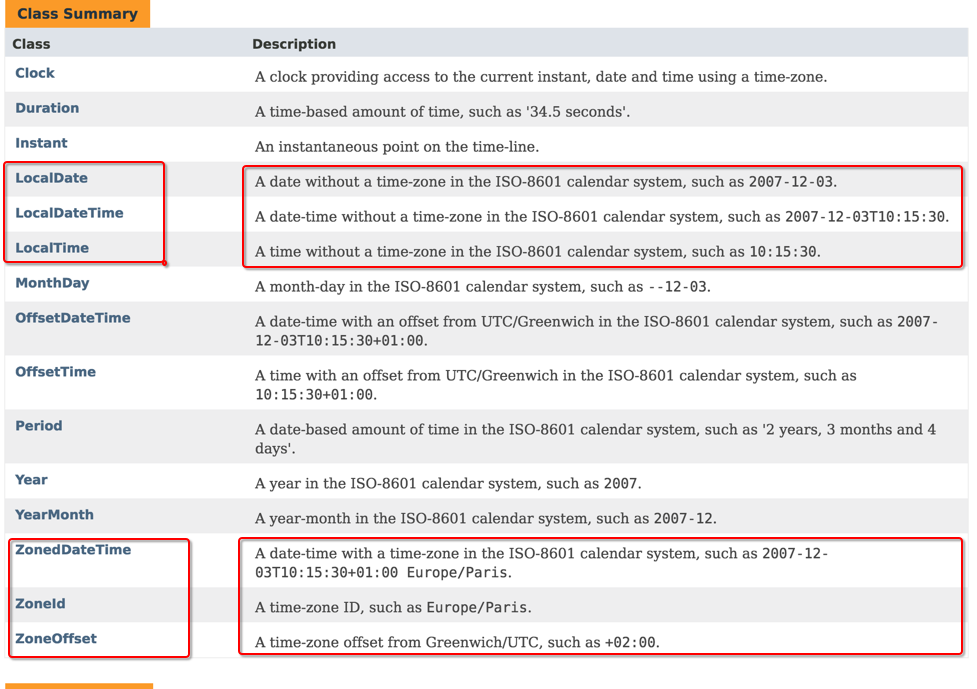
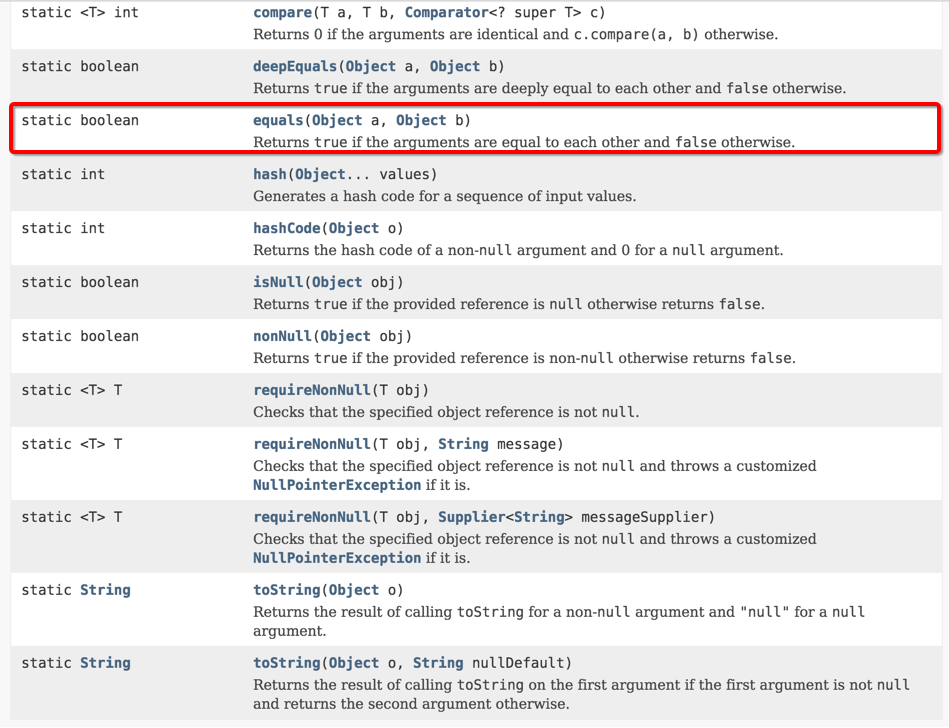

# Utility Classes

<!-- MarkdownTOC -->

- [1. `Date-Time API (JSR 310)`](#1-date-time-api-jsr-310)
    - [1.1 Date / LocalDate 分析](#11-date--localdate-%E5%88%86%E6%9E%90)
        - [1.1.1 Date, LocalDate 常用方法](#111-date-localdate-%E5%B8%B8%E7%94%A8%E6%96%B9%E6%B3%95)
        - [1.1.2 LocalDate 应用: 打印当月日历](#112-localdate-%E5%BA%94%E7%94%A8-%E6%89%93%E5%8D%B0%E5%BD%93%E6%9C%88%E6%97%A5%E5%8E%86)
    - [1.2 LocalDate, LocalTime, LocalDateTime 可以处理不考虑时区的情况](#12-localdate-localtime-localdatetime-%E5%8F%AF%E4%BB%A5%E5%A4%84%E7%90%86%E4%B8%8D%E8%80%83%E8%99%91%E6%97%B6%E5%8C%BA%E7%9A%84%E6%83%85%E5%86%B5)
    - [1.3 ZonedDateTime, ZoneId, ZoneOffset 考虑时区的情况](#13-zoneddatetime-zoneid-zoneoffset-%E8%80%83%E8%99%91%E6%97%B6%E5%8C%BA%E7%9A%84%E6%83%85%E5%86%B5)
- [2. Objects](#2-objects)
- [3. Arrays](#3-arrays)
    - [3.1 Frequently used methods](#31-frequently-used-methods)

<!-- /MarkdownTOC -->

<a name="1-date-time-api-jsr-310"></a>
## 1. `Date-Time API (JSR 310)` 

在 JDK 1.8 之前，`Date-Time API` 存在诸多问题: 

- **非线程安全**: `java.util.Date`是非线程安全的，所有的日期类都是可变的，这是Java日期类最大的问题之一;  

- **设计很差**: Java Date / Time 的定义并不一致，在 `java.util` 和 `java.sql` 的包中都有日期类，此外用于格式化和解析的类在 `java.text` 包中定义。`java.util.Date` 同时包含日期和时间，而 `java.sql.Date` 仅包含日期，将其纳入 `java.sql` 包并不合理。另外这两个类都有相同的名字，这本身就是一个非常糟糕的设计;

- **时区处理麻烦**: 日期类并不提供国际化，没有时区支持，因此 Java 引入了 `java.util.Calendar` 和 `java.util.TimeZone` 类，但他们同样存在上述所有的问题;

**总结:**  
JDK 1.8 新增了 `java.time` 及其子包, 用于处理日期, 时间, 日期-时间, 时区, instants(时刻), during(过程), clock(时钟);

在 `java.time` 包下提供了很多新的 API。以下为两个比较重要的 API：
- Local: 简化了日期时间的处理，没有时区的问题;  
- Zoned: 通过指定的时区处理日期时间; 



<a name="11-date--localdate-%E5%88%86%E6%9E%90"></a>
### 1.1 Date / LocalDate 分析

Java 中时间是用距离 epoch 的毫秒数表示的,其中 epoch 指的是: 19700101 00:00:00 UTC;

Java 标准库中的 Date 类用来表示特定的时间点状态. 虽然这种特定的时间点可以描述大部分地区的 Gregorian 阳历, 但是不能表示特殊的历法, 如: 中国农历. 类库设计者决定将 **保存时间点(Date, 用于表示时间点)** 和 **给时间点命名分开(LocalDate, 用于特定的日历表示法)**.

```java
/**
 * The class <code>Date</code> represents a specific instant
 * in time, with millisecond precision.
 * Date 类使用毫秒数表示具体的时间
 * <p>
 * Prior to JDK&nbsp;1.1, the class <code>Date</code> had two additional
 * functions.  It allowed the interpretation of dates as year, month, day, hour,
 * minute, and second values.  It also allowed the formatting and parsing
 * of date strings.  Unfortunately, the API for these functions was not
 * amenable to internationalization.  As of JDK&nbsp;1.1, the
 * <code>Calendar</code> class should be used to convert between dates and time
 * fields and the <code>DateFormat</code> class should be used to format and
 * parse date strings.
 * The corresponding methods in <code>Date</code> are deprecated.
 * JDK 1.1 之前, Date 类可以操作 year, month, day, hour, minute, second; 但是, Date 类不支持国际化. 因此, JDK 1.1 之后, Calendar 类被用来 covert between dates and time fields, 同时, DateFormat 类被用来格式化和转化时间字符串.
 * 
 * The corresponding methods in <code>Date</code> are deprecated.
 * 因此 Date 中国相应的方法, 就 Deprecated
 * 
 * @since   JDK1.0
 */

```

```java
/**
 * A date without a time-zone in the ISO-8601 calendar system,
 * such as {@code 2007-12-03}.
 * <p>
 * {@code LocalDate} is an immutable date-time object that represents a date,
 * often viewed as year-month-day. Other date fields, such as day-of-year,
 * day-of-week and week-of-year, can also be accessed.
 * For example, the value "2nd October 2007" can be stored in a {@code LocalDate}.
 * <p>
 * This class does not store or represent a time or time-zone.
 * Instead, it is a description of the date, as used for birthdays.
 * It cannot represent an instant on the time-line without additional information
 * such as an offset or time-zone.
 * <p>
 * The ISO-8601 calendar system is the modern civil calendar system used today
 * in most of the world. It is equivalent to the proleptic Gregorian calendar
 * system, in which today's rules for leap years are applied for all time.
 * For most applications written today, the ISO-8601 rules are entirely suitable.
 * However, any application that makes use of historical dates, and requires them
 * to be accurate will find the ISO-8601 approach unsuitable.
 *
 * @implSpec
 * This class is immutable and thread-safe.
 *
 * @since 1.8
 */

```

<a name="111-date-localdate-%E5%B8%B8%E7%94%A8%E6%96%B9%E6%B3%95"></a>
#### 1.1.1 Date, LocalDate 常用方法

**请注意:**  
不需要记住 Date 中 Month / DayOfMonth / DayOfWeek 的起始值;  
在 LocalDate 中, 只存储了 year, month, day, month 起始值: 1; dayOfMonth 起始值: 1=January; dayOfWeek 起始值: 1=Monday;

**LocalDate is an immutable date-time object that represents a date. (线程安全的) **

```java
/**
 * The {@code DateDemo} class represents  
 * the usage of Date and LocalDate
 * 
 * Date: 仅用于表示时间点
 * 常用方法: 
 * new Date()
 * after(): boolean
 * before(): boolean
 * compareTo(): int (before: -1; after: 1, 推荐使用 after()/before() 方法)
 * equals(): boolean
 * toInstance(): Instance
 * toString(): String
 * 
 * LocalDate: 表示特定的日历表示法
 * 通过静态方法, 进行实例化:
 * LocalDate.now() / LocalDate.of(year, month, day);
 * getYear() / getMonthValue() / getDayOfMonth() / getDayOfWeek().getValue()
 * plusDays(): 不会改变 instance field (access method)
 * minusDays()
 * 
 * @author Forrest Lyu, devlyu@163.com
 * @version 1.0  , Aug 21, 2017
 * 
 */
public class DateDemo {
    public static void main(String[] args) {
//      Locale.setDefault(Locale.CHINA);
        
        //1. Date
        Date now = new Date();  // 不需要考虑是从 0 还是 1 开始记录
        
        //2. LocalDate
        LocalDate ld = LocalDate.now();
        LocalDate birthday = LocalDate.of(1995, 11, 5); // 出生日期, 请注意: 没有 0 或 1 开始的问题
        System.out.println("Forrest Lyu'birthday: " + birthday.getYear() + "-" + birthday.getMonthValue() + "-"
                + birthday.getDayOfMonth());
        
        // 2.1 instance method: plusDays(long daysToAdd);
        LocalDate age = birthday.plusDays(10000);
        System.out.println("10000 days:  " + age.getYear() + "-" + age.getMonthValue() + "-"
                + age.getDayOfMonth());
        
        
    }
}

```

<a name="112-localdate-%E5%BA%94%E7%94%A8-%E6%89%93%E5%8D%B0%E5%BD%93%E6%9C%88%E6%97%A5%E5%8E%86"></a>
#### 1.1.2 LocalDate 应用: 打印当月日历

```java
/**
 * The {@code MyCalendar} class represents Calendar.
 * 
 * @author Forrest Lyu, devlyu@163.com
 * @version 1.0  , Aug 21, 2017
 * 
 */
public class MyCalendar {
    /*
     * 如何计算某个月的天数, 以及给定一个日期, 判断是周几;
     */
    public static void main(String[] args) {
        // 1. get the current month and dayOfMonth
        LocalDate date  = LocalDate.now();
        int currentMonth = date.getMonthValue();    //1=January....
        int currentDay = date.getDayOfMonth();  //1=startDayOfMonth
        
        // 2. set date to start, and get dayOfWeek
        date = date.minusDays(currentDay-1);    
        int dayOfWeek = date.getDayOfWeek().getValue(); //1=Monday; 2= Tuesday ...
        
        // 3. print the header, and indent
        System.out.println("Mon Tue Wen Thu Fri Sat Sun");
        for(int i=1; i<dayOfWeek; ++i) {
            System.out.print("    ");
        }
        
        // 4. iterate
        while (date.getMonthValue() == currentMonth) {
            System.out.printf("%3d", date.getDayOfMonth());
            if (date.getDayOfMonth() == currentDay) {
                System.out.print("*");
            } else {
                System.out.print(" ");
            }
            date = date.plusDays(1);
            
            if (date.getDayOfWeek().getValue() == 1) {  // 1=Monday
                System.out.println();
            }
        }
        
    }
}

```

<a name="12-localdate-localtime-localdatetime-%E5%8F%AF%E4%BB%A5%E5%A4%84%E7%90%86%E4%B8%8D%E8%80%83%E8%99%91%E6%97%B6%E5%8C%BA%E7%9A%84%E6%83%85%E5%86%B5"></a>
### 1.2 LocalDate, LocalTime, LocalDateTime 可以处理不考虑时区的情况


<a name="13-zoneddatetime-zoneid-zoneoffset-%E8%80%83%E8%99%91%E6%97%B6%E5%8C%BA%E7%9A%84%E6%83%85%E5%86%B5"></a>
### 1.3 ZonedDateTime, ZoneId, ZoneOffset 考虑时区的情况


<a name="2-objects"></a>
## 2. Objects
> java.util.Objects; 1.7

This class consists of static utility methods for operating on objects. These utilities include null-safe or null-tolerant methods for computing the hash code of an object, returning a string for an object, and comparing two objects.
**(null 对象安全的的方法!)**



|                   methods                    |                                 explanation                                 |                                         |                                |                                     |                                          |
|:--------------------------------------------:|:---------------------------------------------------------------------------:|:---------------------------------------:|:------------------------------:|:-----------------------------------:|:----------------------------------------:|
|   static boolean equals(Objct a, Object b)   |   如果 a, b 都为 null, 则返回 true; 如果只有其中一个位 null, 则返回 false; 否则返回 a.equals(b);   |   static it hash(Object... objects) 7   |   返回一个 散列码, 由提供的所有对象的散列码组合得到   |   static int hashCode(Object a) 7   |   如果 a 为 null, 返回 0; 否则返回 a.hashCode()   |


<a name="3-arrays"></a>
## 3. Arrays
>java.util.Arrays; 1.2

This class contains various methods for manipulating arrays (such as sorting and searching). This class also contains a static factory that allows arrays to be viewed as lists.
The methods in this class all throw a NullPointerException, if the specified array reference is null, except where noted.

The documentation for the methods contained in this class includes briefs description of the implementations. Such descriptions should be regarded as implementation notes, rather than parts of the specification. Implementors should feel free to substitute other algorithms, so long as the specification itself is adhered to. (For example, the algorithm used by sort(Object[]) does not have to be a MergeSort, but it does have to be stable.)

<a name="31-frequently-used-methods"></a>
### 3.1 Frequently used methods

|                      methods                      |                                   explanation                                   |                                       |                 |
|:-------------------------------------------------:|:-------------------------------------------------------------------------------:|:-------------------------------------:|:---------------:|
|   static Boolean equals(type[] a, type[] b) 5.0   |   如果两个数组长度和元素都相同, 则返回 true; 在 Object[] 对象数组中, 如果都为 null 则返回 true; 否则返回 false;   |   static int hashCode(type[] a) 5.0   |   计算素组 a 的散列码   |


