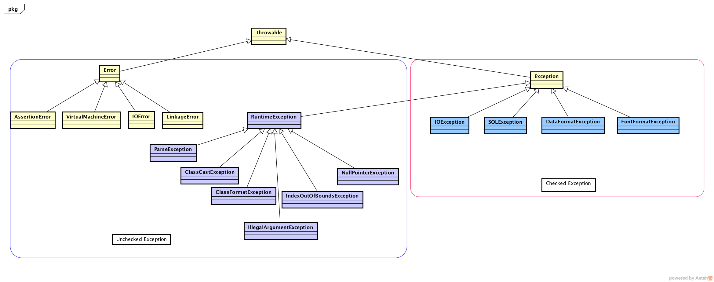

# Exception Handling
> 异常处理, 是 Java 的一种 **健壮机制** , 用于处理正常运行程序可能出现的意外情况. 
> 
> 异常处理提供了一种 **将正常代码和错误处理代码分开** 的有效方式; 

<!-- MarkdownTOC -->

- [1. 基础概念](#1-%E5%9F%BA%E7%A1%80%E6%A6%82%E5%BF%B5)
- [2. Exception \(异常\)](#2-exception-%E5%BC%82%E5%B8%B8)
    - [2.1 The hierarchy \(异常继承体系\)](#21-the-hierarchy-%E5%BC%82%E5%B8%B8%E7%BB%A7%E6%89%BF%E4%BD%93%E7%B3%BB)
    - [2.2 声明 Check Exception](#22-%E5%A3%B0%E6%98%8E-check-exception)
    - [2.3 除了声明异常, 还可以手动捕获异常](#23-%E9%99%A4%E4%BA%86%E5%A3%B0%E6%98%8E%E5%BC%82%E5%B8%B8-%E8%BF%98%E5%8F%AF%E4%BB%A5%E6%89%8B%E5%8A%A8%E6%8D%95%E8%8E%B7%E5%BC%82%E5%B8%B8)
    - [2.4 The Skills Using Exceptin Handling](#24-the-skills-using-exceptin-handling)
- [3. Assert \(断言\)](#3-assert-%E6%96%AD%E8%A8%80)
- [4. Log \(日志\)](#4-log-%E6%97%A5%E5%BF%97)
- [5. The Advanced Skills of Debug](#5-the-advanced-skills-of-debug)

<!-- /MarkdownTOC -->


<a name="1-%E5%9F%BA%E7%A1%80%E6%A6%82%E5%BF%B5"></a>
## 1. 基础概念
1.1 健壮的程序, 应当做到: 
- 向用户通报错误;
- 保存所有工作的结果;
- 允许用户用妥善的形式退出程序;

1.2 异常处理的任务: 

异常处理的任务就是将控制权从错误产生的地方转移到能够处理这种情况的 Exception Handler (异常处理器).

1.3 异常处理机制运行流程:

当 Java 程序中, 方法 A 发生异常无法完成它的任务时, 就需要 throw (抛出) 一个封装了错误信息的对象; 注意: 此时方法 A 会立即退出, 不会返回任何值; 调用方法 A 的方法也无法继续执行; 取而代之的是, 异常处理机制开始搜寻能够处理这种异常情况的 Exception Handler (异常处理器).

1.4 JavaSE 8 API: [Throwable](https://github.com/ForrestLyu/JavaSE-Practice-Path/blob/master/Notes/resource/Throwable.java)



``` java
/*
1.  
The Throwable class is the superclass of all errors and exceptions in the Java language. Only objects that are instances of this class (or one of its subclasses) are thrown by the Java Virtual Machine or can be thrown by the Java throw statement. 
Throwable 类是所有 errors 和 exceptions 的基类, 只有 Throwable 及其子类的对象实例才能够被 JVM 或者 throw 子句 throw(抛出).

2. 
Similarly, only this class or one of its subclasses can be the argument type in a catch clause. For the purposes of compile-time checking of exceptions, Throwable and any subclass of Throwable that is not also a subclass of either RuntimeException or Error are regarded as checked exceptions.
类似地, Throwable 及其子类的对象实例可以作为 catch 子句的参数. 

在 Java 语言规范中, 将派生于 Error 和 RuntimeException 类的所有异常, 称为 unchecked exception .

3. 
Instances of two subclasses, Error and Exception, are conventionally(通常地) used to indicate that exceptional situations have occurred. Typically, these instances are freshly created in the context of the exceptional situation so as to include relevant information (such as stack trace data).

4. 
A throwable contains a snapshot of the execution stack of its thread at the time it was created. (异常中包含线程运行栈中的信息). It can also contain a message string that gives more information about the error. Over time, a throwable can suppress other throwables from being propagated(激发). Finally, the throwable can also contain a cause: another throwable that caused this throwable to be constructed. The recording of this causal information is referred to as the chained exception facility, as the cause can, itself, have a cause, and so on, leading to a "chain" of exceptions, each caused by another. (异常链)

5. 
One reason that a throwable may have a cause is that the class that throws it is built atop a lower layered abstraction, and an operation on the upper layer fails due to a failure in the lower layer. It would be bad design to let the throwable thrown by the lower layer propagate outward, as it is generally unrelated to the abstraction provided by the upper layer. Further, doing so would tie the API of the upper layer to the details of its implementation, assuming the lower layer's exception was a checked exception. Throwing a "wrapped exception" (i.e., an exception containing a cause) allows the upper layer to communicate the details of the failure to its caller without incurring either of these shortcomings. It preserves the flexibility to change the implementation of the upper layer without changing its API (in particular, the set of exceptions thrown by its methods).

6. 
A second reason that a throwable may have a cause is that the method that throws it must conform to a general-purpose interface that does not permit the method to throw the cause directly. For example, suppose a persistent collection conforms to the Collection interface, and that its persistence is implemented atop java.io. Suppose the internals of the add method can throw an IOException. The implementation can communicate the details of the IOException to its caller while conforming to the Collection interface by wrapping the IOException in an appropriate unchecked exception. (The specification for the persistent collection should indicate that it is capable of throwing such exceptions.)

7. 
A cause can be associated with a throwable in two ways: via a constructor that takes the cause as an argument, or via the initCause(Throwable) method. New throwable classes that wish to allow causes to be associated with them should provide constructors that take a cause and delegate (perhaps indirectly) to one of the Throwable constructors that takes a cause. Because the initCause method is public, it allows a cause to be associated with any throwable, even a "legacy throwable" whose implementation predates the addition of the exception chaining mechanism to Throwable.

9. 
By convention, class Throwable and its subclasses have two constructors, one that takes no arguments and one that takes a String argument that can be used to produce a detail message. Further, those subclasses that might likely have a cause associated with them should have two more constructors, one that takes a Throwable (the cause), and one that takes a String (the detail message) and a Throwable (the cause).


*/
public class Throwable
extends Object
implements Serializable {
    /*
     1. constructors
    */
    public Throwable() {
        fillInStackTrace();
    }

    public Throwable(String message) {
        fillInStackTrace();
        detailMessage = message;
    }
   
    /*
     2. frequently used methods
    */

    public synchronized Throwable getCause() {
        return (cause==this ? null : cause);
    }

    /*
     * 1. 获取错误的详细信息
     */
    public String getMessage() {
        return detailMessage;
    }

    public StackTraceElement[] getStackTrace() {
        return getOurStackTrace().clone();
    }

    public void printStackTrace() {
        printStackTrace(System.err);
    }

    public String toString() {
        String s = getClass().getName();
        String message = getLocalizedMessage();
        return (message != null) ? (s + ": " + message) : s;
    }
}
```

**另外常用的方法: `e.getClass().getName();` 获取异常对象的实际类型**


<a name="2-exception-%E5%BC%82%E5%B8%B8"></a>
## 2. Exception (异常)

<a name="21-the-hierarchy-%E5%BC%82%E5%B8%B8%E7%BB%A7%E6%89%BF%E4%BD%93%E7%B3%BB"></a>
### 2.1 The hierarchy (异常继承体系)


所有异常都是由 `Throwable` 类继承而来, 在下一层分成了两个分支: `Error` 和 `Exception`.

`Error` 类层次结构描述了 Java 程序运行中内部错误和资源耗尽错误. **应用程序不应该 throw 此类错误**. 如果出现此类错误, 应当: 告知用户错误信息, 并尽量安全退出程序(保存操作数据、安全退出).

Exception 类层次结构又分为了: **RuntimeException 和 其他异常**; 其中, 由程序编写错误导致的异常属于 **RuntimeException**; 而程序本身没有问题, 但是由于 IO 错误这类问题导致的异常, 属于 **其他异常**
1. 派生于 RuntimeException 的异常包含下面几种情况:
    - ClassCastException
    - IndexOutOfBoundsException
    - NullPointerException
    - ArithmeticException (For Example, an integer "divide by zero")

2. 不是派生于 RuntimeException 的异常: 
    - IOException (如, FileNotFoundException)

**Java 语言规范中, 将派生于 `Error` 类和 `RuntimeException` 类的所有异常成为 unchecked (非受查异常), 所有其他异常成为 check (受查) 异常. 编译器将会检查, 是否为所有 check 异常, 提供 Exception Handler.**

<a name="22-%E5%A3%B0%E6%98%8E-check-exception"></a>
### 2.2 声明 Check Exception
```java
// 受查异常, 举例
// FileInputStream constructor
public FileInputStream(String name) throws FileNotFoundException

```

在自己编写方法的时候, 不必将所有可能抛出的异常都进行声明. 什么时候需要, 哪些异常需要, 遵循以下规则:  
1. 调用一个 **抛出 checked exception 方法**, 如: FileInputStream();
2. 程序运行中, 发现错误, 并用 throw 子句抛出 Exception 时;
3. 程序出现错误时, 如: a[-1] = 0, 会 throw 一个 ArrayIndexOutOfBoundsException 异常;
4.  Java 的 JVM 和 Runtime Library 出现 internal Error;

**但是不需要声明 Java 的 Error, 任何程序代码都具有抛出此类异常的可能性, 但是我们无能为力; 同时, 也不需要声明从 RuntimeException 继承的那些 uncheck exception, 这是在编写程序的时候, 可以避免的.**

```java
// 假设在读取文件信息的时候, 遇到异常结束的情况
String readData() throws IOException {
    //...

    while(operational conditon) {
        if(!in.hasNext()) {  // EOF
            //....


            if (n < fileLength) {
                String msg = "文件没有读完, 就终止啦!"
                throw new EOFException(msg);
            }
        }
    }
}


```


有时候, 现有的异常类, 无法准确的描述问题, 这个时候, 就可以自定义异常类.

```java
class CustomException extends EOFException {
    // 应当定义 2 个构造方法
    public CustomException() {}

    public CustomException(String msg) {
        super(msg);
    }
}

```

<a name="23-%E9%99%A4%E4%BA%86%E5%A3%B0%E6%98%8E%E5%BC%82%E5%B8%B8-%E8%BF%98%E5%8F%AF%E4%BB%A5%E6%89%8B%E5%8A%A8%E6%8D%95%E8%8E%B7%E5%BC%82%E5%B8%B8"></a>
### 2.3 除了声明异常, 还可以手动捕获异常
> 声明异常, 会使异常抛出方法之外, 让调用者进行异常处理; 捕获异常, 可以在当前方法中处理.

```java
try {
    // code that might throw exceptions
} catch (FileNotFoundException | UnknownHostException e) {
    // emergency action for missing files and unknown hosts
} catch (IOException e) {
    // emergency action for all other IO exception
} finally {
    // Finally, 
}
```

**注意: 只有捕获的异常彼此之间不存在子类关系, 才能合并 catch 子句**


<a name="231-%E5%86%8D%E6%AC%A1-throw-exception-%E5%85%B7%E4%BD%93%E7%9A%84%E5%BA%94%E7%94%A8"></a>
#### 2.3.1 再次 throw exception (具体的应用)
>`调用者不需要指导具体的异常类型, 只需要指导子系统是否有异常

```java
try {
    //access the database
} catch (SQLException e) {
    throw ServletException("databse exception" + e.getMessage());
}
```

当然还有更好的方法: 

```java
try {
    //access the database
} catch (SQLException e) {
    Throwable se = new ServletException("database error");
    se.initCause(e);
    throw se;
}

// 获取
Throwable e = se.getCause();
```

<a name="232-%E8%A7%A3%E8%80%A6-trycatch-%E5%92%8C-tryfinally"></a>
#### 2.3.2 解耦 try/catch 和 try/finally
> 应该解耦 try/catch 和 try/finally 语句块, 这样可以提高代码的清晰度

```java
InputStram is = ....;
try {
    try {
            // code that might throw exceptions
        } finally {
            is.close();
        }
} catch (IOException e) {
    // show error message;
}

/*
 解析:
 1. 内层的 try/finally 语句块, 只有一个职责, 确保关闭 input stram;
 2. 外层的 try/catch 语句块, 只有一个职责, 确保报告出现的错误, 此外, 还可以报告 finally 子句中的错误
*/
```


<a name="233-try-with-resource"></a>
#### 2.3.3 try with resource
> 假如资源是属于一个实现了 AutoCloseable 接口的类, 就可以使用 JavaSE 7 提供的 try-with-resource 语法

```java
try (Scanner in = new Scanner(new FileInputStream("/user/local/file.txt"), "UTF-8");
PrintWriter out = new PrintWriter("out.txt")) {
    while (in.hasNext()) {
        out.println(in.next());
    }
} catch (IOException e) {
    //handl the exception
}

```


<a name="234-%E5%88%86%E6%9E%90-stack-trace-%E5%85%83%E7%B4%A0"></a>
#### 2.3.4 分析 stack trace 元素

todo...

<a name="24-the-skills-using-exceptin-handling"></a>
### 2.4 The Skills Using Exceptin Handling

1. Handing Exception 不能代替 Unit Test

`if (!s.empty()) s.pop()` 优于使用 try-catch 子句

2. 不要过分细化异常

3. 利用 The Hierarchy of Exception

4. 不要压制 Exception

5. 早 throw, 晚 catch 


<a name="3-assert-%E6%96%AD%E8%A8%80"></a>
## 3. Assert (断言)

在实际的开发中, 会有大量类似于 `if (x<0) {return;}` 语句, 这样的代码在测试完毕之后, 也不会自动删除, 降低了程序的运行效率; 而 Assert 就是为了解决这样的问题.

assert 是测试和调试阶段使用的工具;

```java
assert a > 0;
if( a<10) {

} else if (a <20) {

} else {
    assert a>=20;
    //....
}

```

<a name="4-log-%E6%97%A5%E5%BF%97"></a>
## 4. Log (日志)
> log 是一种在程序的整个生命周期内都可以使用的策略性工具


<a name="5-the-advanced-skills-of-debug"></a>
## 5. The Advanced Skills of Debug


