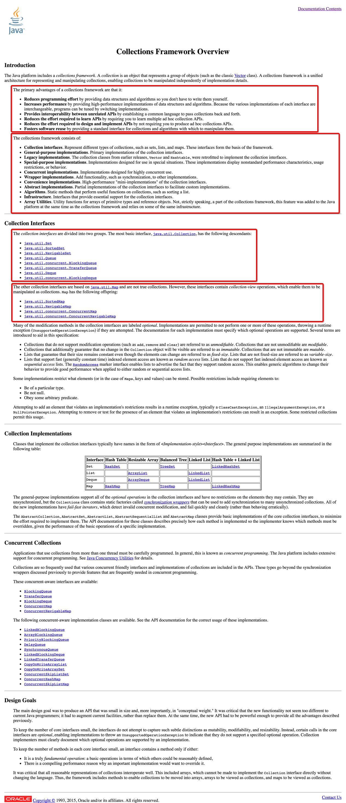

# Array & Java Collection Framework

<!-- MarkdownTOC -->

- [0. 分析 Array 与 ArrayList](#0-%E5%88%86%E6%9E%90-array-%E4%B8%8E-arraylist)
- [1. The Collections Framework](#1-the-collections-framework)
- [x. hash value 和 hashCode\(\)](#x-hash-value-%E5%92%8C-hashcode)

<!-- /MarkdownTOC -->

<a name="0-%E5%88%86%E6%9E%90-array-%E4%B8%8E-arraylist"></a>
## 0. 分析 Array 与 ArrayList 
数组是一种数据结构, 是用来存储同一类型值的集合. 但是数组存在长度固定, 不可改变的问题.

通过 Java Collections Framework 中的 `ArrayList` 可以解决这样的问题.

<a name="1-the-collections-framework"></a>
## 1. The Collections Framework 

The collections framework is a unified(标准统一的) architecture for representing and manipulating collections, enabling them to be manipulated independently of the details of their representation. 

It reduces programming effort while increasing performance. It enables interoperability among unrelated APIs, reduces effort in designing and learning new APIs, and fosters(培育) software reuse. The framework is based on more than a dozen(一组) collection interfaces. It includes implementations(实现) of these interfaces and algorithms to manipulate them.

Java 集合框架体系是标准统一的体系结构, 用于存储和操作集合; 基于一组集合接口的框架, 包括: 这些接口的具体实现类和操作他们的算法.




<a name="x-hash-value-%E5%92%8C-hashcode"></a>
## x. hash value 和 hashCode()

```java
/**
     * Returns a hash code value for the object. This method is
     * supported for the benefit of hash tables (哈希表) such as those provided by
     * {@link java.util.HashMap}.
     * <p>
     * The general contract(规定0) of {@code hashCode} is:
     * <ul>
     * <li>Whenever it is invoked on the same object more than once during
     *     an execution of a Java application, the {@code hashCode} method
     *     must consistently(一致地) return the same integer, provided no information
     *     used in {@code equals} comparisons on the object is modified.
     *     This integer need not remain consistent from one execution of an
     *     application to another execution of the same application.
     * 在同一个程序中, 如果变量指向的对象没有被改变, 则 hashCode() 返回的值不应该改变; 
     * 在不同的程序中, 不要求相同;
     * 
     * <li>If two objects are equal according to the {@code equals(Object)}
     *     method, then calling the {@code hashCode} method on each of
     *     the two objects must produce the same integer result.
     * 如果 equals() 方法相等, 则 hashCode() 一定想相等;
     * <li>It is <em>not</em> required that if two objects are unequal
     *     according to the {@link java.lang.Object#equals(java.lang.Object)}
     *     method, then calling the {@code hashCode} method on each of the
     *     two objects must produce distinct integer results.  However, the
     *     programmer should be aware that producing distinct integer results
     *     for unequal objects may improve the performance of hash tables.
     * </ul>
     * 对于不同的对象, 产生不相等的 hash value 有利于提升 hash table 的执行效率;
     * <p>
     * As much as is reasonably practical, the hashCode method defined by
     * class {@code Object} does return distinct integers for distinct
     * objects. (This is typically implemented(实施) by converting the internal
     * address of the object into an integer, but this implementation
     * technique is not required by the
     * Java&trade; programming language.)
     *
     * @return  a hash code value for this object.
     * @see     java.lang.Object#equals(java.lang.Object)
     * @see     java.lang.System#identityHashCode
     */
    public native int hashCode();
```


```java
/**
* Returns a hash code for this string. The hash code for a
* {@code String} object is computed as
* <blockquote><pre>
* s[0]*31^(n-1) + s[1]*31^(n-2) + ... + s[n-1]
* </pre></blockquote>
* using {@code int} arithmetic, where {@code s[i]} is the
* <i>i</i>th character of the string, {@code n} is the length of
* the string, and {@code ^} indicates exponentiation.(幂运算)
* (The hash value of the empty string is zero.)
*
* @return  a hash code value for this object.
*/

public int hashCode() {
    int h = hash;
    if (h == 0 && value.length > 0) {   //  如果 hash 不等于 0 , 就说明已经运算过了
        char val[] = value;

        for (int i = 0; i < value.length; i++) {
            h = 31 * h + val[i];
        }
        hash = h;
    }
    return h;
}
```

