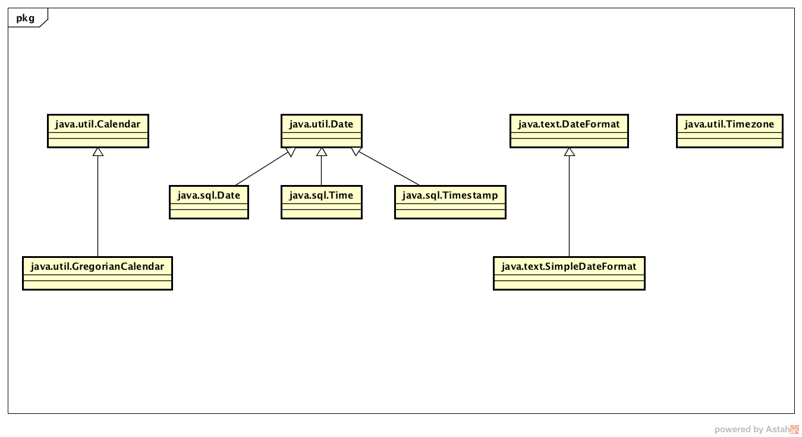
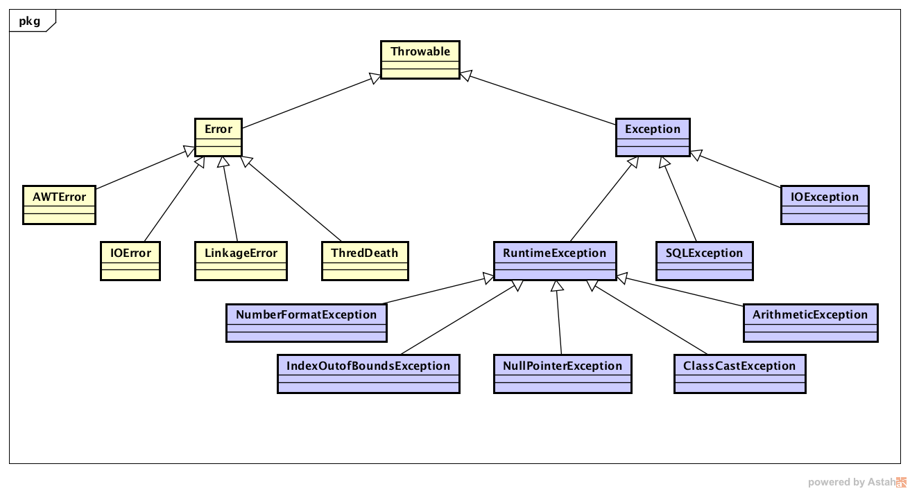

# JavaSE
> JavaSE 知识体系结构总结

## 1. Java 发展历史、现状与未来的发展

## 2. Java 运行机制、基础语法部分（数据类型、运算符、控制流程）

## 3. Java 面向对象

### 3.x Enum 枚举类

## 4. Java 常用工具类

### 4.1 String / StringBuffer / StringBuilder 
> Java 字符串就是 **Unicode 字符序列**；  
> Java 没有内置的字符串类型，而是在 JavaSE 中提供了 **类 String**，用 **” “** 括起来的字符序列就是字符串实例； 

1. String 是 **不可变字符序列**，StringBuffer、StringBuilder 都是 **可变字符序列**，但是 StringBuffer 是 **线程安全、效率较低**，StringBuilder 是 **线程不安全、效率较高**。
2. 在使用局部变量的时候，通常使用 StringBuilder。


### 4.2 时间、日期相关类
> Date： 都是以 1 开始，现在很多功能都被废弃了，只用于 long milisec 相关（宏观的）
> DateFormat / SimpleDateFormat
> Calendar

**Date** 通过 new Date() 构造一个当前时间日期类，仅仅用于显示时间。  
常用方法： compareTo(Date anotherDate) / getTime()：返回毫秒数 / setTime(long milisec):  
**注意：** 不作为具体操作类！

**Calendar** 

```java

Calendar cal = Calendar.getInstance();
cal.set(2017, 7-1, 31);	// 请注意，月份是从 0 开始的，与此相同的，是 week
int year = cal.get(Calendar.YEAR);
int month = cal.get(Calendar.MONTH) + 1;
int day = cal.get(Calendar.DATE);
int week = cal.get(Calendar.DAY_OF_WEEK) -1;
```



### 4.3 Math 
> 主要要掌握 **精度运算**

#### java.util.Math.BigInteger

#### java.util.Math.BigDecimal


### 4.4 File
> java.io.File

## 5. Java 集合类（集合、泛型、异常机制）

### 5.0 Array（特殊化的集合）

```java
// 数组定义相关

int[] nums = new int[16];	// nums.length == 16
int[] nums2 = {123, 123};	// nums2.length == 2
// int[] nums3 = new int[]; 这样是错误的写法
int[] num4;	//这样不能直接使用，因为此时是 null;


// 多维数组定义和初始化方式：默认、静态、动态

int[][] a1 = new int[4][];
int[][] a2 = new int[4][4];
int[][] a3 = {{}, {}, {}};
int[][] a4 = new int[][] {};
//	int[][] a5 = new int[4][] {}; 错误
//	int[][] a6 = new int[4][5] {};	错误
//	int[][] a7 = new int[][];	错误，必须至少指定 第一个 参数的大小
```

### 5.x Throwable


## 6. JDBC 与 MySQL

## 7. Java IO

## 8. Java 多线程

## 9. Java 网络编程

## 10. 类的加载与反射机制

## 11. 数据结构与算法：Java 语言实现


