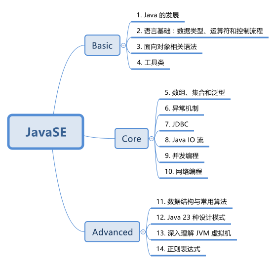

# JavaSE 
> JavaSE 学习笔记与实践总结

## 1. Study Notes
> 笔记在[此文档目录中](https://github.com/ForrestLyu/JavaSE-Practice-Path/tree/master/notes)

1. Java History, Present and Future   
2. Java 语言基础：数据类型、运算符和控制流程  
3. 面向对象：封装、继承、多态、接口  
4. 反射  
5. 代理  
6. JDK 库分析和常用库总结  
7. 异常、断言和日志  
8. 泛型程序设计  
9. 数组和集合框架  
10. 并发编程  
11. Java IO 流  
12. 拓展：XML  
13. 网络编程  
14. 数据库编程  
15. 国际化  
16. 拓展：JavaBean  
17. 拓展：Java 安全模型
18. 拓展：三种处理代码技术
19. 分布式对象
20. 拓展：本地方法  

## 2. Project Practice

